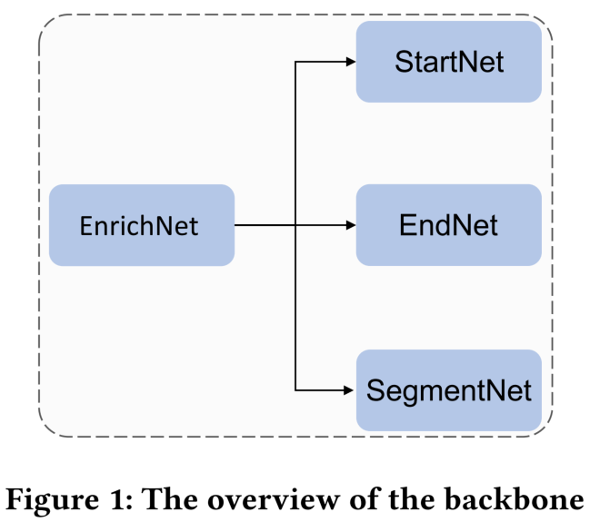
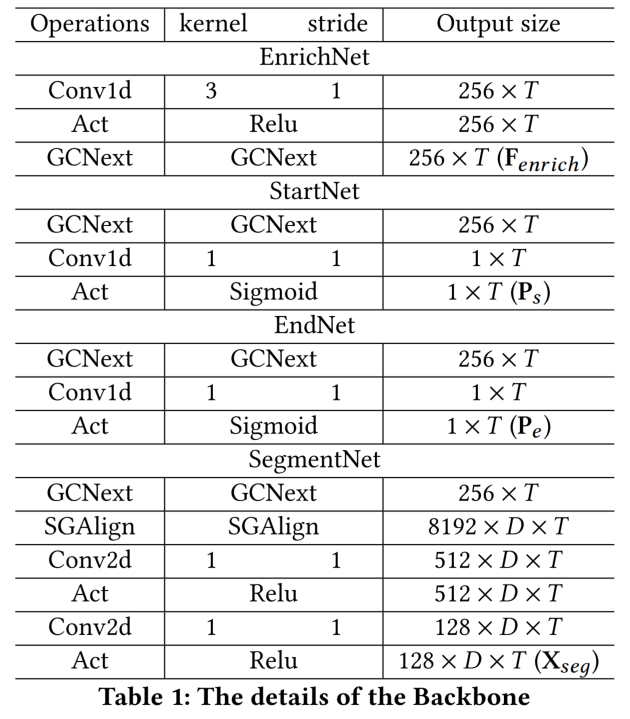
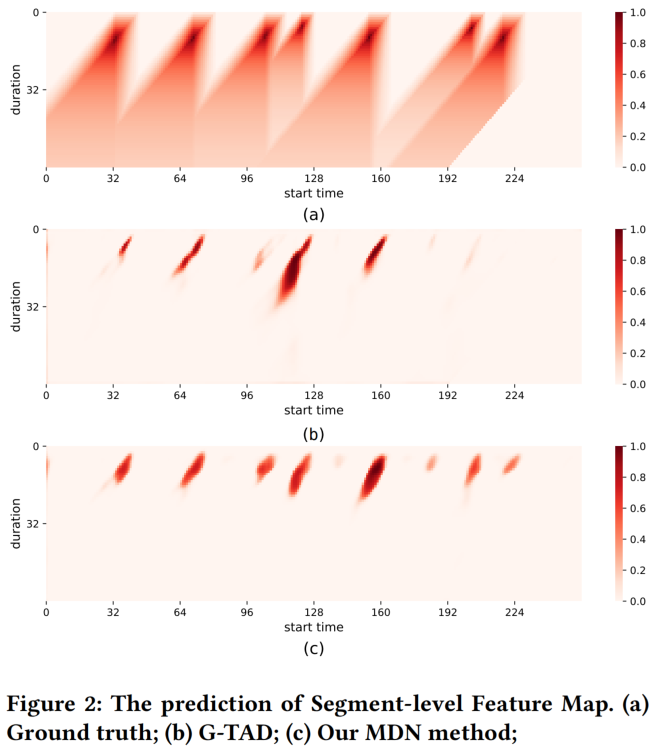
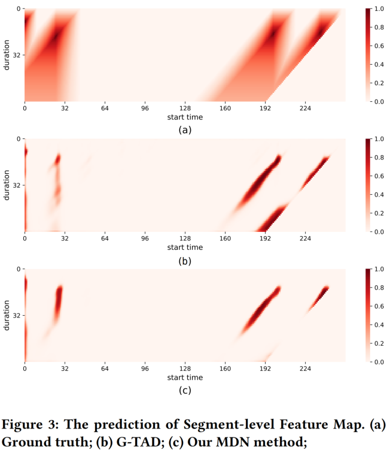
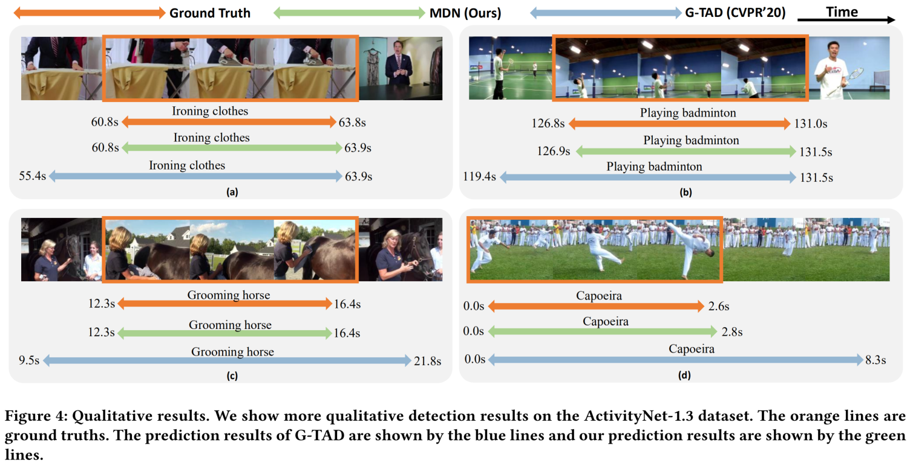

## Supplementary Material

### More Details

#### Details of Backbone

Here, we describe the structure of the Backbone in detail. Following the previous work G-TAD (CVPR'20), we use the GCNeXt, a graph convolution block that adaptively incorporates multi-level semantic context into video features, and the SGAlign layer, a way that embeds video features into the same Euclidean space, to construct our Backbone. 

As shown in Figure 1, for the feature sequence  of an input video, we use the EnrichNet to generate context-enriched features , which provides a shared feature sequence for StartNet, EndNet, and SegmentNet. The StartNet is used to classify each temporal location in  based on whether they are starting points of an action instance and output starting probability sequence . The EndNet is used to classify each temporal location in  based on whether they are ending points of an action instance and output ending probability sequence . For the SegmentNet, we use the SGAlign layer to extract the feature for all candidate video segments, and output the . The  and  will serve as the input to **1**-th MDM in our MDN model. The details of each Net are shown in Table 1.

### More Visualizations

#### Prediction of Segment-level Feature Map

To intuitively explore the impact of our model on different videos, we visualize more prediction of segment-level feature maps of different models (Our MDN method and G-TAD) on the THUMOS-14 dataset. 

As shown in Figure 2 and Figure 3, our MDN method can produce less noise and more complete detection of all action instances. This again shows that generating specific convolution kernels for each video segment is valid for the temporal action detection task.

#### Qualitative Detection Results

To further demonstrate the effectiveness of our proposed  model, we also illustrate some qualitative results on the ActivityNet-1.3 dataset, as shown in Figure 4. We choose G-TAD as the previous method for comparison.

As can be seen from Figure 4, compared with G-TAD, our model can produce more accurate detection results for some complex action instances.
Especially, for videos with almost the same scene, our method can dynamically capture some key action information to accurately detect the boundary, as shown in Figure 4 (a), (b), (c), and (d).

